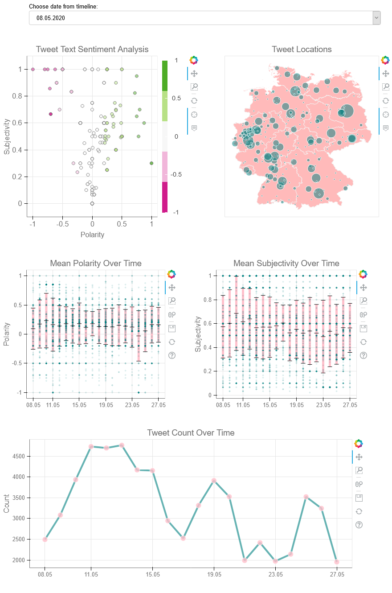

# Corona-GeoSentiment
Sentiment analysis of social media data is a powerful tool. By using twitter's API using corona keywords, this analysis allows to create temporal and spatial snapshots of the public opinion regarding topics related to the Corona-Crisis and visualize with interactive bokeh graphs. To limit the number of languages for the sentiment analysis, I first started out to analyze tweets captured in Germany. To view the plot, visit the [Corona-GeoSentiment site here.](https://mehrshadpakdel.github.io/Corona-GeoSentiment/)


<p align="center">
  
</p>

## Setting Up

### Clone

- Clone this repo to your local machine using https://github.com/MehrshadPakdel/Corona-GeoSentiment.git

### Prerequisites

- This project requires a series of modules:
```
conda install tweepy
conda install dataset
conda install sqlite3
conda install textblob
conda install pandas
conda install numpy
conda install geopandas
conda install bokeh
conda install jinja2
```

## Features

- Retrieve Corona-related tweets by using the Twitter's standard API and the <a href="http://docs.tweepy.org/en/latest/" target="_blank">Tweepy</a> library for Python
- Collect tweet data and save them to a SQLite database using <a href="https://docs.python.org/3/library/sqlite3.html" target="_blank">sqlite3</a>
- Tweet text processing and sentiment analysis using <a href="https://textblob.readthedocs.io/en/dev/" target="_blank">TextBlob</a> for english and german languages
- Mapping user locations to geographic coordinates and creating map of germany using <a href="https://geopandas.org/" target="_blank">geopandas</a> and <a href="https://docs.bokeh.org/en/latest/" target="_blank">bokeh</a>
- Creating interactive graphs with <a href="https://docs.bokeh.org/en/latest/" target="_blank">bokeh</a>
- Bringing everything together and create customized html templates using <a href="https://palletsprojects.com/p/jinja/" target="_blank">Jinja2</a>

## Usage

- Will be updated soon. Thanks for your patience :)
